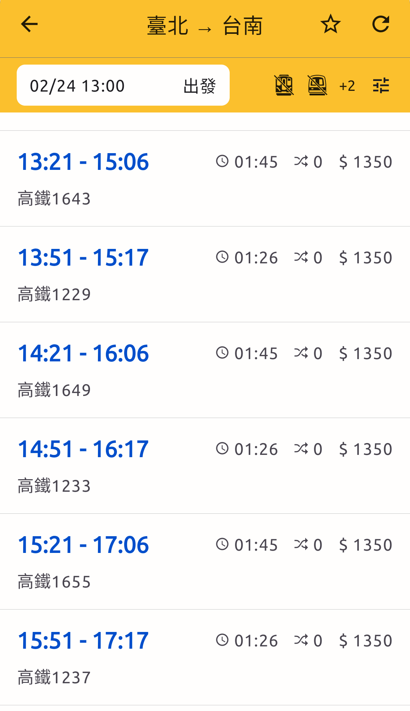
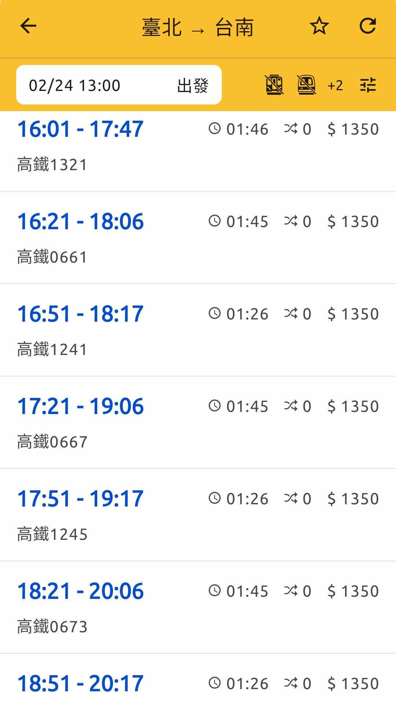

# 2023-02-17

## 出發時間與規劃結果問題

以 `台北` -> `台南`, 運具選擇 `高鐵`, 為例:

出發時間: `2023-02-24T12:21:00`

```json
{
    "origin": "25.04767,121.51698",
    "destination": "22.92508,120.2862",
    "gc": 0.0,
    "top": 3,
    "transit": "3",
    "depart": "2023-02-24T12:21:00",
    "first_mile_mode": 0,
    "last_mile_mode": 0
}
```

結果出現 `1237次`

```json
"transport": {
    "mode": "HSR",
    "name": "高鐵-1237車次",
    ...
},
```
但是 `1237次` 的出發時間為 `15:51`, 在 `12:21` - `15:51` 之間, 仍有許多車次



經測試, 查詢時間落在 `12:21` - `16:05` 之間, 皆會出現 `1237次` 車次

查詢 `15:51` 之後的結果就比較合理
- `16:06` - `17:05` 結果為 `1241次` 次
- `17:06` - `18:05` 結果為 `1245次` 次

結果較符合預期


